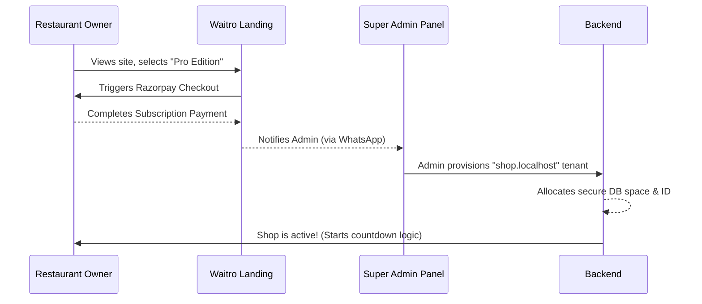
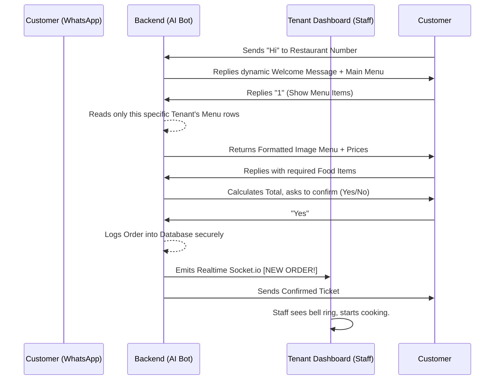

# Waitro: Product Overview & Architecture Flow

Waitro is a dynamic, multi-tenant SaaS application that allows restaurants and cafes to completely automate digital food ordering using a highly interactive WhatsApp AI Assistant. 

The software eliminates hardware dependency by transforming a single mobile WhatsApp conversation into a complete, interactive food catalog, seamlessly routing orders to a localized dashboard securely controlled by the restaurant staff.

---

## 🏗️ 1. Core Ecosystem Architecture

The Waitro platform runs on **three primary frontend environments** and **one central backend engine**:

1. **Waitro Landing Page (`/waitro-landing`, Port 3001)**
   - **Audience**: Prospective Restaurant Owners
   - **Purpose**: The modern, Gen-Z marketing storefront. Business owners arrive here to view the flashy product demo, browse the features, and trigger subscriptions via Razorpay. It also directly routes them to your Super Admin WhatsApp number for provisioning.

2. **Super Admin Control Panel (`/control-panel`, Port 3000)**
   - **Audience**: You (The Platform Proprietor)
   - **Purpose**: The master command center. Protected by strict database-encrypted credentials (`venkatesh`), this panel tracks total active subscriptions, pending tenants, and aggregate revenue. From here, you generate subdomains for new restaurant clients, monitor valid lease lengths/payments, and enforce subscription terminations automatically.

3. **Tenant Dashboard (`/frontend`, Port 5175, e.g., `shop.localhost:5175`)**
   - **Audience**: The Subscribed Restaurant Staff (Tenants)
   - **Purpose**: The operational daily software. Running completely isolated on bespoke DNS subdomains, restaurant managers utilize this dashboard to manipulate their digital Menu catalog, process incoming live kitchen Orders, connect their physical restaurant WhatsApp number via QR-Code binding, and dynamically alter the AI Chatbot's conversational scripts.

4. **Main Backend Service (`/backend`, Port 5000)**
   - **Technology**: Node.js, Express, MongoDB, Socket.io, Whatsapp-Web.js
   - **Purpose**: The master relational brain. It intelligently intersects multi-tenant traffic. It maps the correct Menu tables from MongoDB to the distinct subdomain requesting them, calculates expiration timelines, routes real-time WebSocket pulses when an order changes status, and manages the intricate state-machine logic for thousands of autonomous WhatsApp bot replies simultaneously.

---

## 🌊 2. User & Operational Flows

### Flow A: The Tenant Onboarding Flow (Restaurant Signup)
How a fresh Restaurant client is brought into the ecosystem safely:

 

### Flow B: Configuration & Setup Flow (Daily Setup)
How the manager connects the AI to their real business phone:

1. **Domain Access**: The manager opens `http://shop.localhost:5175/`. The frontend silently reaches out to the backend to authenticate `shop` as a legit, fully-paid tenant ID and loads the UI.
2. **Menu Upload**: The manager types out their food catalog, assigns prices, and uploads graphical images. (Backend binds these entries strictly to their local `x-tenant-id`).
3. **WhatsApp Linking**: The manager proceeds to the Settings tab where a fresh WhatsApp QR Code is presented. They pull out their actual business restaurant mobile phone, scan the QR code via WhatsApp "Linked Devices", and instantaneously the Node.js Backend binds a headless Chrome instance to proxy that number!
4. **Customizing the Bot**: The manager alters the "Welcome Message" text via the settings tab to say *"Welcome to my neon diner!"*

 

### Flow C: The Customer Ordering Flow (The Core Product)
The real magic! How a hungry customer places a real order dynamically:

 

### Flow D: The Kitchen Dispatch Flow (Order Fulfillment)
When the food is ready:
1. The chef finishes the meal. The manager clicks `"Mark Ready"` on the interface.
2. The Frontend pushes a PATCH request `(/api/orders/ID/status)` -> `ready`.
3. The Node.js Backend commits this state change.
4. The Backend hooks back into the WhatsApp Client instance and automatically fires a message silently via the business number to the Customer's phone: *"🎉 Your order is ready! Please come pick it up."* 

 

### Flow E: The Protection Flow (Enforcing Paywalls)
1. At the exact second the tenant's payment lifecycle expires (e.g. 1-Month Basic Lease concludes).
2. The frontend forcibly blocks UI rendering, locking managers out of the screen.
3. Simultaneously, the backend immediately halts the `whatsappService` instantiation for that specific tenant, crashing the worker and completely neutralizing their automated AI replies until the exact moment you (the Super Admin) re-instate them!
